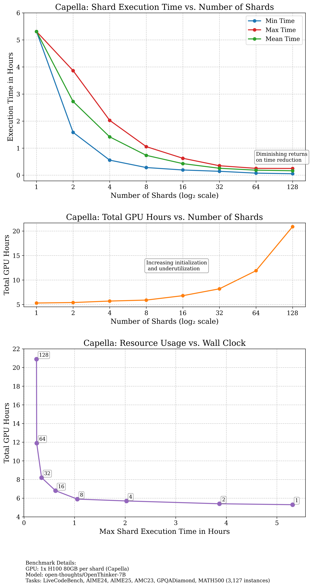

# Capella HPC Cluster Setup

This document details the setup process for running distributed evaluations on the Capella HPC cluster.

## Important Notes

- **Internet access**: Unlike Leonardo, Capella compute nodes have internet access
- **Shared workspace**: Setup uses a shared workspace for collaboration and efficient resource usage
- **Standard conda**: Uses standard Miniconda instead of Mamba
- **H100 GPUs**: Capella provides NVIDIA H100 80GB GPUs, which offer improved performance compared to A100s

## Environment Setup

Follow these steps to set up the environment on Capella:

```bash
# Allocate a workspace
# Guide: https://doc.zih.tu-dresden.de/quickstart/getting_started/?h=workspaces#allocate-a-workspace
ws_allocate -F horse -r 7 -m ryanmarten2000@gmail.com -n DCFT_Shared -d 100
echo "export DCFT=/data/horse/ws/ryma833h-DCFT_Shared" >> ~/.bashrc

# Set up shared access for project members
# Check your group membership
groups # should show p_finetuning
ls -ld $DCFT # Should show p_finetuning ownership

# Set appropriate permissions for collaboration
# Owner and group get full access, others have no access
chmod -R u+rwX,g+rwX,o-rwx $DCFT
# Set default ACLs for new files to maintain these permissions
setfacl -R -d -m u::rwX,g::rwX,o::- $DCFT

# Set up conda in the shared workspace
mkdir -p $DCFT/miniconda3
wget https://repo.anaconda.com/miniconda/Miniconda3-latest-Linux-x86_64.sh -O $DCFT/miniconda3/miniconda.sh
bash $DCFT/miniconda3/miniconda.sh -b -u -p $WORK/miniconda3
rm $DCFT/miniconda3/miniconda.sh
source $DCFT/miniconda3/bin/activate
conda init  # Adds conda initialization to ~/.bashrc

# Clone repo and create conda environment
git clone git@github.com:mlfoundations/evalchemy.git $DCFT/evalchemy
cd $DCFT/evalchemy
conda create -y --name evalchemy python=3.10
conda activate evalchemy
pip install -e .
pip install -e eval/chat_benchmarks/alpaca_eval

# Setup shared database access
cat << 'EOF' >> $EVALCHEMY/.env
export DB_PASSWORD=XXX
export DB_HOST=XXX
export DB_PORT=XXX
export DB_NAME=XXX
export DB_USER=XXX
EOF

# Create shared HuggingFace cache
mkdir -p $DCFT/huggingface/hub
echo "export HF_HUB_CACHE=$DCFT/huggingface/hub" >> ~/.bashrc
```

## Testing the Setup

Before running full distributed evaluations, test the setup:

```bash
# Test the basic installation with a simple task
OPENAI_API_KEY=NONE python -m eval.eval --model upload_to_hf --tasks AIME25 --model_args repo_id=mlfoundations-dev/AIME25_evalchemy

# Test the launcher with minimal configuration
python eval/distributed/launch.py --model_name open-thoughts/OpenThinker-7B --tasks AIME24 --num_shards 1 --watchdog
```

## Running Distributed Evaluations

To run a distributed evaluation on Capella:

```bash
# Activate the environment
source /data/horse/ws/ryma833h-DCFT_Shared/miniconda3/bin/activate
conda activate evalchemy
cd /data/horse/ws/ryma833h-DCFT_Shared/evalchemy

# Launch the distributed evaluation
python eval/distributed/launch.py --model_name open-thoughts/OpenThinker-7B --tasks LiveCodeBench,AIME24,AIME25,AMC23,GPQADiamond,MATH500 --num_shards 8 --max-job-duration 2 --watchdog
```

The distributed launcher will:
1. Detect the Capella environment
2. Use the appropriate HuggingFace cache location
3. Use the correct sbatch script for Capella
4. Monitor the job progress (with `--watchdog`)
5. Upload results when complete

## Monitoring Jobs

You can monitor your jobs using standard SLURM commands:

```bash
# Check job status
squeue -u $USER

# Get detailed job information
sacct -j <job_id> -X --format=JobID,JobName,State,Elapsed

# Cancel a job if needed
scancel <job_id>
```

## Benchmarking Shard Performance

We conducted a benchmarking study on Capella to understand the scaling behavior of our distributed evaluation framework. Below are the results for various shard configurations:

| **Shards** | **Max Time** | **Min Time** | **Mean Time** | **Total GPU Hours** | **Huggingface** |
|------------|--------------|--------------|---------------|---------------------|-----------------|
| 128        | 00:14:54     | 00:03:12     | 00:09:48      | 20.9                | [15-56-58](https://huggingface.co/datasets/mlfoundations-dev/OpenThinker-7B_eval_03-11-25_15-56-58_0981) |
| 64         | 00:15:07     | 00:04:32     | 00:11:07      | 11.9                | [18-36-38](https://huggingface.co/datasets/mlfoundations-dev/OpenThinker-7B_eval_03-11-25_18-36-38_0981) |
| 32         | 00:20:55     | 00:08:35     | 00:15:19      | 8.2                 | [18-36-16](https://huggingface.co/datasets/mlfoundations-dev/OpenThinker-7B_eval_03-11-25_18-36-16_0981) |
| 16         | 00:37:29     | 00:11:31     | 00:25:37      | 6.8                 | [18-35-50](https://huggingface.co/datasets/mlfoundations-dev/OpenThinker-7B_eval_03-11-25_18-35-50_0981) |
| 8          | 01:03:20     | 00:16:56     | 00:44:00      | 5.9                 | [15-56-57](https://huggingface.co/datasets/mlfoundations-dev/OpenThinker-7B_eval_03-11-25_15-56-57_0981) |
| 4          | 02:01:38     | 00:33:22     | 01:25:02      | 5.7                 | [15-56-57](https://huggingface.co/datasets/mlfoundations-dev/OpenThinker-7B_eval_03-11-25_15-56-57_0981) |
| 2          | 03:51:51     | 01:34:58     | 02:43:24      | 5.4                 | [18-35-31](https://huggingface.co/datasets/mlfoundations-dev/OpenThinker-7B_eval_03-11-25_18-35-31_0981) |
| 1          | 05:18:37     | 05:18:37     | 05:18:37      | 5.3                 | [18-35-01](https://huggingface.co/datasets/mlfoundations-dev/OpenThinker-7B_eval_03-11-25_18-35-01_0981) |



To run your own benchmarks with different shard counts:

```bash
# Activate the environment
source /data/horse/ws/ryma833h-DCFT_Shared/miniconda3/bin/activate
conda activate evalchemy
cd /data/horse/ws/ryma833h-DCFT_Shared/evalchemy

# Run with different shard counts (replace N with the shard count)
SHARDS=N && python eval/distributed/launch.py --model_name open-thoughts/OpenThinker-7B --tasks LiveCodeBench,AIME24,AIME25,AMC23,GPQADiamond,MATH500 --num_shards $SHARDS --watchdog
```

Key insights from benchmarking:
- H100 GPUs show significantly better performance than A100s on Leonardo (5:18 vs. 10:14 for single-shard runs)
- 8 shards is recommended as the default for a good balance of resource efficiency and job scheduling ease
- 16-32 shards provides a good tradeoff between execution time and GPU efficiency
- More than 64 shards shows diminishing returns on time reduction
- For fastest results (under 15 minutes), 64-128 shards is recommended but incurs higher GPU hour costs
